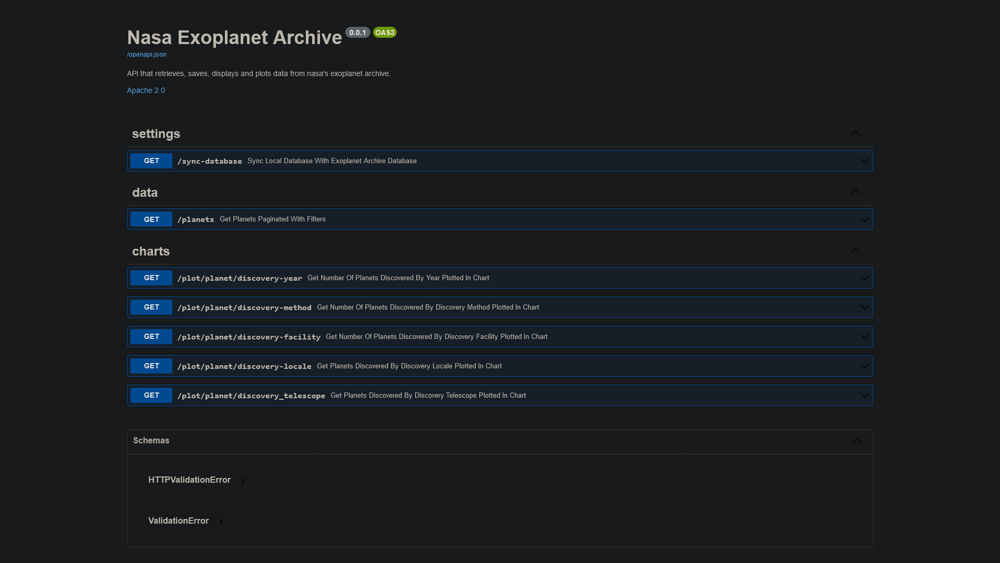

# Nasa Exoplanet Archive

Project that gather and display data about NASA's exoplanets, [using NASA's datasource](https://exoplanetarchive.ipac.caltech.edu/cgi-bin/TblView/nph-tblView?app=ExoTbls&config=PS). Check my blog post about the experience building this project [here!](https://gracieledamasceno.github.io/dev-on-track/technology/2022/07/23/nasa-exoplanet-archive.html)

---
## Dependencies

Ensure that you have `python3` and `pip` installed on your machine. Access the project's folder and run the following 
commands in order to install our used dependencies:

```
pip install fastapi
pip install uvicorn
pip install requests
pip install pandas
pip install matplotlib
```

You also need an instance o MongoDB running. The default host and port used in the project is `localhost` `27017`, so ensure
that the configuration at `database.py` file matches your MongoDB environment. 

## How to run it

Access `nasa-exoplanet-archive\src` in your command line and run the following command:

```
python main.py
```
Now, check the following address using your favorite browser: `http://localhost:8000/docs`

You'll be welcomed by a swagger page, like this one:



Now you're ready to go!

## Endpoints

To check out endpoints documentation, [click here.](openapi/api.apib)
